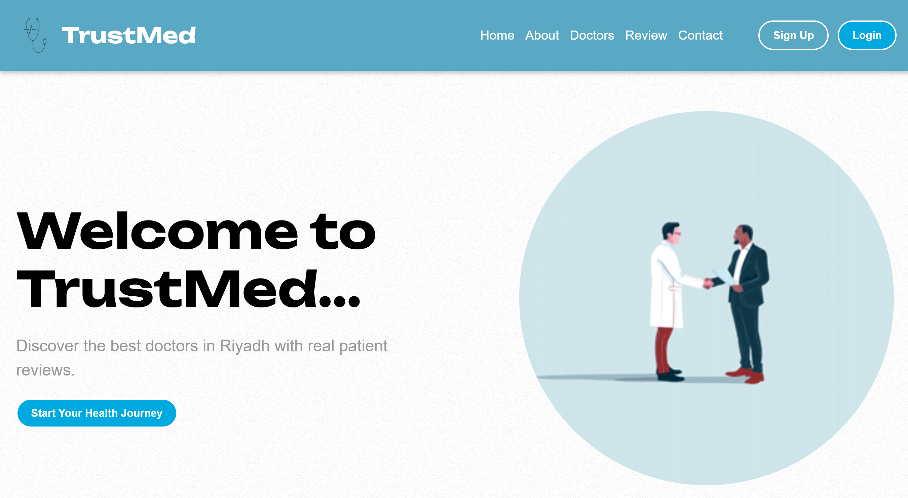

# WepProject #CS346

#Overview of the Website 
The website aims to connect doctors from various medical specialties across Riyadh, allowing users to easily search for suitable doctors. It also enables users to generate reports for their health conditions and provide ratings for doctors based on their experiences, with the ability to add reviews. The site features a user-friendly interface with clear divisions of content, making navigation simple. Additionally, it provides seamless communication with the platform’s administration. Authentication is available on every page, with integration with a MongoDB database. 

**#Target Audience:** 
The target audience for this website includes:
•	Patients and users searching for suitable doctors across Riyadh. 
•	University students who need to generate medical reports to be sent to relevant departments. 
•	Users who want to rate doctors and share their experiences with others. 
•	Doctors and hospitals looking to engage more with patients through interactive online services. 

**#Goals:** 
• Simplify the process of finding doctors across various specialties in Riyadh. 
• Provide authentic ratings and reviews from patients to help users choose the right doctor. 
• Generate customized health reports that can be sent directly to relevant entities. 
• Enhance the user experience with a clear, easy-to-use interface and well-organized sections. 
• Expand the service in the future to include other cities, increasing its reach. 

**#Unique Feature:** Direct Report Generation and Submission 
Our website offers a unique feature that sets it apart from existing platforms: a clear and intuitive interface that allows users to generate a report about their health condition and send it directly to the desired recipient via email.
For example, a university student can generate a health report through the platform and, if needed, send it directly to the relevant department or health service responsible for student health cases. This feature provides an efficient way to share personal health reports, making it easier for users to communicate with institutions or healthcare providers without the need for intermediaries. 

**#Flow chart** 

**#Project Setup** 
1-	Setting up the Basic Tools: 
•  Install Visual Studio Code (VSC). 
•  Install Node.js. 
•  Install and run MongoDB locally. 
•  Install MongoDB Shell to interact with the database. 
2-	Setting up Git and GitHub: 
•  Install Git. 
•  Create a repository on GitHub. 
•  Add team members to the repository for collaboration and sharing. 
3-	Setting up Wiki Repository: 
•	Create a Wiki in the GitHub repository to document the project. 
4-	Setting up the Project Locally (for team members): 
•	Clone the repository  
•	Install the dependencies 
•	Run the project  
5-	Working with the Database: 
•  Ensure that MongoDB is installed and running locally. 
•  Use MongoDB Shell to interact with the database 
6-	Ensuring the Project Works via HTTP: 
•	Ensure that the server is running at http://localhost:5000 (or the specified port in the project) 
•	Verify that MongoDB is connected and working by checking that the server is running on the specified port in Node.js. 

**#Technologies Used** 
•	Node.js: JavaScript runtime used to build the backend of the application. 
•	Express.js: Web framework for Node.js that simplifies routing and handling HTTP requests. 
•	MongoDB: NoSQL database used to store user and application data. 
•	Mongoose: ODM (Object Data Modeling) library for MongoDB, used to manage data models and interactions with MongoDB. 
•	Git: Version control system used for tracking code changes and collaboration among team members. 
•	GitHub: Platform for hosting the project repository and facilitating team collaboration. 
•	Visual Studio Code (VSC): Integrated development environment (IDE) used for writing and editing code. 
•	MongoDB Shell: Command-line interface for interacting with MongoDB databases. 
•	HTML: Markup language used to structure content on web pages. 
•	CSS: Styling language used to design and lay out the website. 
•	JavaScript: Programming language used to add interactivity and dynamic features to the website. 
•	EJS (Embedded JavaScript): Templating engine used to embed JavaScript into HTML pages, allowing for dynamic page rendering with data from the server. 
•	Google Authentication: Implemented OAuth 2.0 from Google to provide login and authentication for users using their Google accounts, simplifying the authentication process and increasing security. 

**#Some Screenshot** 
### Screenshot 1: Home Page

### Screenshot 2: Dashboard for users

### Screenshot 3: Reviews Page

### Screenshot 4: Add Review

### Screenshot 5: Doctors Page For Gusts
.png)

### Screenshot 6: Doctors Page For Users
.png)

### Screenshot 7: Contact Page 

### Screenshot 8: Athuntication

### Screenshot 9: Database (Doctros Collection)

**#Future Work** 
•	Location-based Services: Add functionality to directly find doctors via a map, allowing users to easily see nearby doctors and hospitals. 
•	Doctor Filtering: Enable users to filter doctors based on their ratings from 1 to 5 to find the most highly rated professionals. 
•	Expansion to Other Cities: Expand the platform to include other cities beyond Riyadh, broadening the accessibility of the service 
•	Appointment Booking: Allow users to book appointments directly via the browser and choose the most suitable hospital based on their preferences. 
•	Doctor's Interface Development: Enhance the doctor’s interface to include features like managing appointments, viewing patient feedback, and updating availability. 
•	Admin Interface Development: Develop the admin interface to manage users, doctors, appointments, and reviews, as well as track the overall health of the platform. 
•	Notifications & Reminders: Implement notifications for upcoming appointments, feedback reminders, or new doctor availability. 

**#Resources** 
•	MongoDB - The database used to store user and doctor data. 
•	Express.js - The framework used to build the backend and handle HTTP requests. 
•	EJS - The templating engine used to embed JavaScript within HTML pages to create dynamic pages. 
•	Google OAuth - Used to provide Google Authentication feature. 
•	Git - The version control system used by the team to track changes and collaborate. 
•	GitHub - The platform used to host the repository and facilitate team collaboration. 
•	Visual Studio Code - The integrated development environment (IDE) used to write and edit code. 
•	Node.js - JavaScript runtime used to build the backend of the application. 
•	Building the Frontend (YouTube Video) - A video tutorial used to help build the frontend of the website. 
•	  Connecting to the Database (YouTube Playlist) - A YouTube playlist used for connecting the project to the MongoDB database. 

**#Team Members** 
--
Rand Abdulaziz AL-khuzaiem 442013948 
Nada  AL-turki 444008569 
Dana AL-shehri 442014081 

Rand: Responsible for building the general pages using CSS and JavaScript, creating the doctor page content, implementing authentication, integrating with the database, inserting doctor data into the database, and working with Node.js and Express.js. She is also responsible for writing the README file. 

Nada: Built the Get Report page, enabling users to send reports to specific entities. She worked with Node.js and Express.js and contributed to preparing the presentation. 

Dana: Responsible for adding the functionality to insert new reviews. She works with Node.js and Express.js and contributed to the flowchart. 

